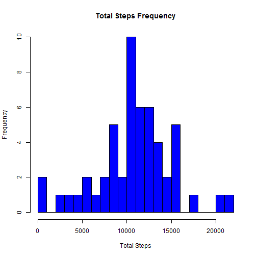
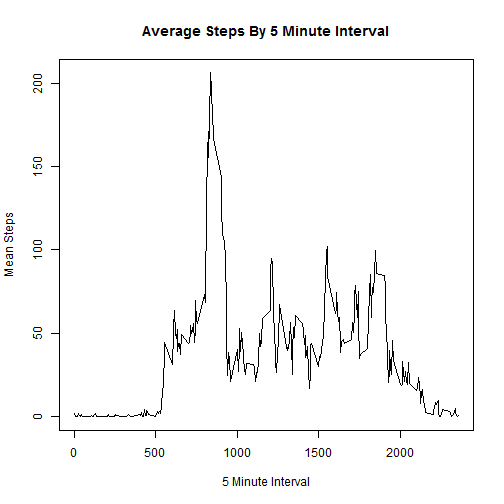
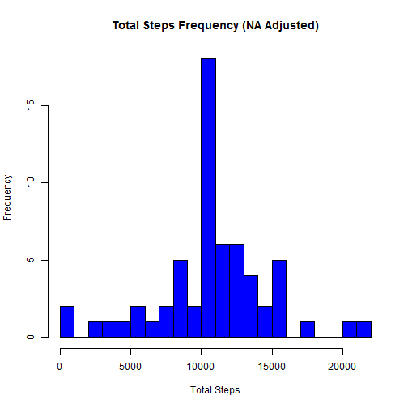
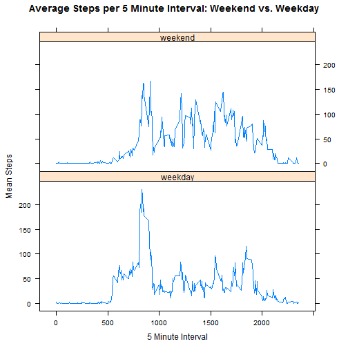

### Bruce Montgomery - 5/16/2015

*I will use italics to comment on my approach to the assignment.*

## Loading and preprocessing the data

Load the data (i.e. read.csv()).
Process/transform the data (if necessary) into a format suitable for your analysis.

*For my assignment, I am using dplyr for data wrangling at each step of the analysis.  
I transfer the data table from read.csv into a dplyr data frame that I will use later.  
I am using the suppress functions to keep the dplyr load from issuing warnings and other messages.*


```r
dtAct <- read.csv('activity.csv')
suppressWarnings(suppressPackageStartupMessages(library(dplyr)));
dfAct <- tbl_df(dtAct)
```

## What is mean total number of steps taken per day?

For this part of the assignment, you can ignore the missing values in the dataset.
Calculate the total number of steps taken per day.
If you do not understand the difference between a histogram and a barplot, research the difference between them. Make a histogram of the total number of steps taken each day.
Calculate and report the mean and median of the total number of steps taken per day.

*I use dplyr group_by and summarise to get the total steps per day.  
I am using a base histogram with an arbitrary number of breaks to show frequency of total steps.  
(There's a good discussion of the histogram approach in the forums [here](https://class.coursera.org/repdata-014/forum/thread?thread_id=21).)  
Finally, I am making the assumption we want to see the mean and median across all the step totals  
(as opposed to a big table showing the mean and median of each day's total).*


```r
dfTot <- dfAct %>% group_by(date) %>% summarise(total_steps=sum(steps))
with(dfTot,hist(total_steps,breaks=22,col="blue",main="Total Steps Frequency",xlab="Total Steps",ylab="Frequency"))
```

 

```r
meanTotSteps <- mean(dfTot$total_steps,na.rm=TRUE)
medianTotSteps <- median(dfTot$total_steps,na.rm=TRUE)
```

*Although we are ignoring the NA values, they have to be removed to get mean and median.  
The mean total number of steps per day is 10766.19.  
The median total number of steps per day is 10765.*

## What is the average daily activity pattern?

Make a time series plot (i.e. type = "l") of the 5-minute interval (x-axis) and the average number of steps taken, averaged across all days (y-axis).  
Which 5-minute interval, on average across all the days in the dataset, contains the maximum number of steps?

*To do the time series plot, I needed to use dplyr to summarise the mean steps per day.  
The mean calculation in dplyr would only work if I removed steps with NA as values.  
I used a base plot of type "l" for the time series plot.*


```r
dfInt <- dfAct %>% group_by(interval) %>% filter(steps!='NA') %>% summarise(mean_steps=mean(steps))
with(dfInt,plot(interval, mean_steps, type="l",main="Average Steps By 5 Minute Interval",xlab="5 Minute Interval", ylab="Mean Steps"))
```

 

```r
maxSteps <- with(dfInt,interval[mean_steps==max(mean_steps)])
```
*The 5 minute interval with the maximum number of steps is 835, which you can see on the graph above.*

## Imputing missing values

Note that there are a number of days/intervals where there are missing values (coded as NA). The presence of missing days may introduce bias into some calculations or summaries of the data.

Calculate and report the total number of missing values in the dataset (i.e. the total number of rows with NAs).


```r
dfNAOnly <- dfAct %>% filter(is.na(steps))
totalMissing <- dim(dfNAOnly)[1]
```
*I used a dplyr filter to get just the NA value records.  
The total number of missing values in the dataset is 2304.*

Devise a strategy for filling in all of the missing values in the dataset. The strategy does not need to be sophisticated. For example, you could use the mean/median for that day, or the mean for that 5-minute interval, etc. Create a new dataset that is equal to the original dataset but with the missing data filled in.

*I decided to replace the missing values with the rounded mean for the 5 minute interval (which I kept in the dfInt  
data frame above).  I struggled with this a bit, but found a good discussion in the forum [here](https://class.coursera.org/repdata-014/forum/thread?thread_id=78),  
which suggested a combination of cbind and dplyr.*


```r
dfActAdj <- cbind(dfAct,dfInt$mean_steps)
colnames(dfActAdj)[4]<-"mean_steps"
dfActAdj <- dfActAdj %>% mutate(mean_steps=round(mean_steps)) %>% mutate(steps=ifelse(is.na(steps),mean_steps,steps))
```

Make a histogram of the total number of steps taken each day and Calculate and report the mean and median total number of steps taken per day. Do these values differ from the estimates from the first part of the assignment? What is the impact of imputing missing data on the estimates of the total daily number of steps?

*Just like the histogram above, I use dplyr group_by and summarise to get the total steps per day.  
and a base histogram with an arbitrary number of breaks to show frequency of total steps.*


```r
dfTotAdj <- dfActAdj %>% group_by(date) %>% summarise(total_steps=sum(steps))
with(dfTotAdj,hist(total_steps,breaks=22,col="blue",main="Total Steps Frequency (NA Adjusted)",xlab="Total Steps",ylab="Frequency"))
```

 

```r
meanTotAdjSteps <- mean(dfTotAdj$total_steps)
medianTotAdjSteps <- median(dfTotAdj$total_steps)
```
*The mean/median for the unadjusted data is as follows:    
The mean total number of steps per day is 10766.19.  
The median total number of steps per day is 10765.* 

*The mean/median for the NA adjusted data is here:  
The mean total number of steps per day is 10765.64.  
The median total number of steps per day is 10762.*

*The mean and median for the NA adjusted data have decreased slightly.*

## Are there differences in activity patterns between weekdays and weekends?

For this part the weekdays() function may be of some help here. Use the dataset with the filled-in missing values for this part.
Create a new factor variable in the dataset with two levels - "weekday" and "weekend" indicating whether a given date is a weekday or weekend day.

*Again, using dplyr and mutate, I added the day column to the adjusted data using the weekdays function,  
and then added the weekday/weekend factor as a column called day_type.*


```r
dfActAdj <- dfActAdj %>% mutate(day=weekdays(as.Date(date))) %>% mutate(day_type=ifelse(day %in% c("Saturday","Sunday"),"weekend","weekday"))
```

Make a panel plot containing a time series plot (i.e. type = "l") of the 5-minute interval (x-axis) and the average number of steps taken, averaged across all weekday days or weekend days (y-axis). See the README file in the GitHub repository to see an example of what this plot should look like using simulated data.

*I used dplyr to group by day_type and interval, then summarise for mean steps.  
The example plot in the assignment was made with lattice, so I did the same.*


```r
dfIntAdj <- dfActAdj %>% group_by(interval,day_type) %>% summarise(mean_steps=mean(steps))
library(lattice)
p <- xyplot(mean_steps ~ interval | day_type, type="l", data = dfIntAdj, layout = c(1,2), main="Average Steps per 5 Minute Interval: Weekend vs. Weekday", xlab="5 Minute Interval", ylab="Mean Steps")
print(p)
```

 

*Thanks for reviewing this assignment!*
